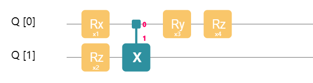
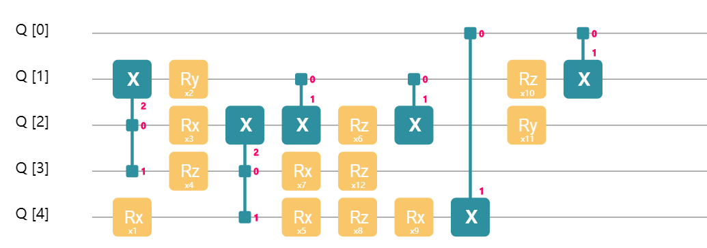
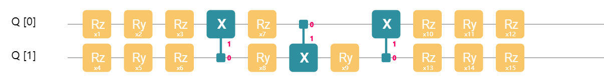
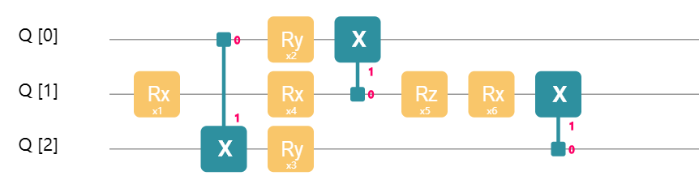
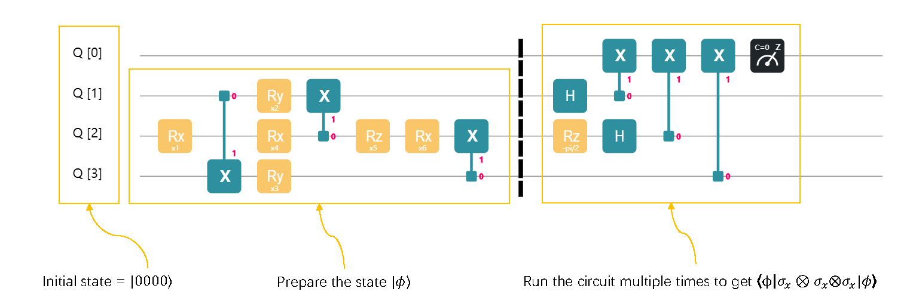
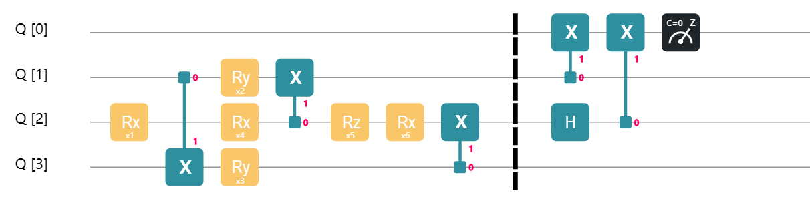
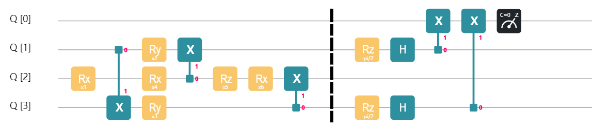

## Variational Quantum Eigensolver (VQE)

> Based on QCompute version 2.0, we have developed QuantumAPP module to enrich and improve the VQE related functions. See [VQE_EN.md](../../../QAPP/tutorials/VQE_EN.md) for details.

Consider the following question: how to find the smallest eigenvalue of a Hermitian matrix $H$? This question is important for physics and quantum chemistry. For an atomic level system, there is a Hamiltonian $H$, which is a Hermitian matrix, that describes the system's characteristics and behaviors. By finding the smallest eigenvalue of $H$ and its corresponding eigenvectors, we can find the ground energy and state of this system. VQE is a quantum technique designed to handle this task. The idea behind VQE is amazingly simple and easy to understand. Suppose $\lambda_\text{min}$ is the smallest eigenvalue of a Hamiltonian $H$. Then for every quantum state $\lvert {\phi}\rangle$,
$$
\langle{\phi} \lvert H\lvert {\phi}\rangle \ge \lambda_\text{min}.
$$
The core of VQE is to minimize $\langle{\phi} \lvert H\lvert {\phi}\rangle$ by adjusting $\lvert {\phi}\rangle$, and thus to estimate $\lambda_\text{min}$ the ground energy of the system. Now, let's learn more about details about VQE, including how to adjust $|\phi\rangle$ and how to compute $\langle{\phi} \lvert H\lvert {\phi}\rangle$.

### Parameterized Quantum Circuit
To adjust a quantum state $\lvert {\phi}\rangle$, we need to build a parameterized quantum circuit.



The figure above shows a 2-qubit quantum circuit controlled by 4 parameters. By adjusting the 4 parameters, we can change the output state of the circuit given a fixed input state. Certainly, you can build a more complex parameterized quantum circuit.



The figure above shows a 5-qubit quantum circuit with 12 parameters. Still, by adjusting those parameters, we can change the output state. Some readers may wonder that, given a fixed input state, whether a parameterized circuit can output an arbitrary quantum state. That depends on the structre of a parameterized circuit. For a 2-qubit system, we can build a parameterized with 15 parameters, shown in the figure below.



By adjusting those 15 parameters, we can generate an arbitrary 2-qubit state. Generally, it is not only hard, but impractical to design a parameterized quantum circuit that can generate any possible quantum state. In practice, we only need a quantum state $|\phi\rangle$ close enough to the ground state $|\phi_{\lambda_\text{min}}\rangle$ to make a good estimation of $\lambda_{min}$.

Now that we understand how to adjust $\lvert {\phi}\rangle$ with a parameterized quantum circuit, let's keep on and learn to use quantum circuits to compute $\langle{\phi} \lvert H\lvert {\phi}\rangle$, the expectation value of $H$ under state $|\phi\rangle$.

### Pauli Measurement
Usually, we decompose $H$ into a linear combination of multiple Hamiltonians $H_i$ with simpler structures. That is,
$$
H = \sum_i c_iH_i,
$$
where $c_i$ is a complex coefficient. For each $H_i$, the expectation value $\langle\phi|H_i|\phi\rangle$ is easy to compute. After computing $\langle\phi|H_i|\phi\rangle$ for all $H_i$, we get $\langle\phi|H|\phi\rangle$ through
$$
\langle{\phi} \lvert H\lvert {\phi}\rangle = \sum_i c_i\langle{\phi} \lvert H_i\lvert {\phi}\rangle.
$$

In many cases, $H$ can be decomposed into $O(\text{poly}(n))$ number of $H_i$, where n is the number of qubit. Each $H_i$ is a tensor product of Pauli matrices, e.g., $\sigma_x\otimes I\otimes\sigma_z\otimes\cdots\otimes \sigma_y$. To be precise,
$$
H_i \in \{I, \sigma_x, \sigma_y, \sigma_z\}^{\otimes n}.
$$
where $I$ is the identity matrix, and $\sigma_x, \sigma_y, \sigma_z$ are the Pauli matrices. In theory, any Hermitian $H$ can be written as a linear combination of tensor products of Pauli matrices. Since to get $\langle{\phi} \lvert H\lvert {\phi}\rangle$ we need to compute every $\langle\phi|H_i|\phi\rangle$, how do we compute $\langle\phi|H_i|\phi\rangle$ in practice? This computation can be done with a technique called Pauli measurement. Let's go through a simple example.

To begin with, we use the following circuit to prepare a 3-qubit quantum state $\lvert {\phi}\rangle$.


Suppose we want to get the value $\langle{\phi} \lvert \sigma_x\otimes \sigma_y\otimes\sigma_z\lvert {\phi}\rangle$, so we build a circuit like the one in the figure below and run it for several times.

Notice that we add an ancilla qubit $q_0$ to our circuit. The purpose of this extra qubit is to help us compute the value of $\langle{\phi} \lvert \sigma_x\otimes \sigma_y\otimes\sigma_z\lvert {\phi}\rangle$. Also notice that we append a new part to the circuit which contains gates including Hadamard​ gates and a $R_z(-\pi/2)$ gate. This new part of circuit is another trick to get $\langle{\phi} \lvert \sigma_x\otimes \sigma_y\otimes\sigma_z\lvert {\phi}\rangle$. For different $H_i$ we need to build different circuits, which we will discuss later. We run the circuit, measure the ancilla, records the result (0 or 1), and repeat the process multiple times. By recording the **frequency** of 0 and 1, we can calculate the **probability** of getting 0 and 1:
$$
\text{The value of }\langle{\phi} \lvert \sigma_x\otimes \sigma_y\otimes\sigma_z\lvert {\phi}\rangle \approx \\ \text{The probability of getting 0} - \text{The probability of getting 1}
$$
The more you repeat, the more accurate your result will be. We have just learned how different $H_i$ have different circuits associate with them. Let me show you what the circuit look like if $H_i = \sigma_z\otimes \sigma_x\otimes I$:

See? The second part of the circuit changed and the rest remains the same. We still run the circuit multiple times, measure the ancilla each time, record the result, and repeat the same procedure to calculate the probability of getting 0 minus the probability of getting 1, which is very close to $\langle{\phi} \lvert \sigma_z\otimes \sigma_x\otimes I\lvert {\phi}\rangle$. Of course, the more it repeats, the closer the result gets. There are some rules you need to follow:

* $\sigma_x\to$ $Hadamard$ gate + $CNOT$ gate
* $\sigma_y\to$ $R_z(-\pi/2)$gate + $Hadamard$ gate + $CNOT$ gate
* $\sigma_z\to$ $CNOT$ gate
* $I \to$ add nothing

Have you seen patterns from the circuit that corresponds with $\sigma_x\otimes \sigma_y\otimes\sigma_z$? We add a $Hadamard$ gate on $q_1$ and a $CNOT$ gate, because the first item in $\sigma_x\otimes \sigma_y\otimes\sigma_z$ is $\sigma_x$; we add a $R_z(-\pi/2)$ gate, $Hadamard$ gate on $q_2$ and a $CNOT$ gate. That is because the second part of $\sigma_x\otimes \sigma_y\otimes\sigma_z$ is $\sigma_y$. We only add a $CNOT$ gate on $q_3$ because the third part is $\sigma_z$. Now, let's figure out the circuit associated with$\sigma_z\otimes \sigma_x\otimes I$:

Apply $CNOT$ gate onto $q_1$, because the first part of $\sigma_z\otimes \sigma_x\otimes I$ is $\sigma_z$; $Hadamard$ gate and $CNOT$ gate are applied onto $q_2$, because the second part is $\sigma_x$; add nothing on $q_3$, because the third part is $I$. Let's take a quiz, what is the circuit that measures $\langle{\phi} \lvert \sigma_y\otimes I\otimes \sigma_y\lvert {\phi}\rangle$ ? The answer is in the figure below:


Not surprisingly, we get all gradients to get the value $\langle{\phi} \lvert H\lvert {\phi}\rangle$, where
$$H = 0.5*\sigma_x\otimes \sigma_y\otimes\sigma_z + 0.2*\sigma_z\otimes \sigma_x\otimes I + 0.8 * \sigma_y\otimes I\otimes \sigma_y$$
Just run the three circuit independently multiple times and record the measurement records on the ancilla. Calculate$\langle{\phi} \lvert H_i\lvert {\phi}\rangle$, times the coefficient, add them up and we are done. I know it looks intimidating and complicated the first time you read this. Just read the previous part a few more times, and you will get it through. There is nothing incomprehensible in VQE.


### Gradient Descent
After understanding the details of previous sections, we keep moving. Notice that the value you get is actually an approximation of $\langle{\phi} \lvert H\lvert {\phi}\rangle$. The more measurements, the more precise the result will be. Second of all, by adjusting the six parameters in the circuit, you get new values for $\langle{\phi} \lvert H\lvert {\phi}\rangle$ every time. Isn't that interesting, it is a multivariate function! In fact, in almost all papers related to VQE, scholars unanimously view$\langle{\phi} \lvert H\lvert {\phi}\rangle$ as a multivariate function.

$$
L(\theta_1, \theta_2,\cdots, \theta_m) \\=
\langle{\phi(\theta_1, \theta_2,\cdots, \theta_m)} \lvert H\lvert {\phi(\theta_1, \theta_2,\cdots, \theta_m)}\rangle \\ = 
\langle{00\cdots 0} \lvert U^\dagger(\theta_1, \theta_2,\cdots, \theta_m) HU(\theta_1, \theta_2,\cdots, \theta_m)\lvert {00\cdots 0}\rangle
$$

where $U(\theta_1, \theta_2,\cdots, \theta_m)$ is the matrix representation of the parameterized circuit. If you do view it as a multivariate function, the problem of finding the smallest eigenvalue of $H$ is equivalent to finding the minimum value of $L(\theta_1, \theta_2,\cdots, \theta_m)$. Let's do a brief recap. We want to find the smallest eigenvalue of a Hermitian $H$, so we decompose it to a linear summation of $H_i$, tensor product of Pauli matrices and identity matrices. We build a parameterized circuit and apply appropriate gates in the end according to the rules for each $H_i$, measure the ancilla multiple times for each circuit, calculate $\langle{\phi} \lvert H_i\lvert {\phi}\rangle$ and add them back to get an approximation of $\langle{\phi} \lvert H\lvert {\phi}\rangle$
$$
L(\theta_1, \theta_2, \cdots \theta_m) = \langle{\phi} \lvert H\lvert {\phi}\rangle = \sum_i c_i\langle{\phi} \lvert H_i\lvert {\phi}\rangle
$$
You might realize that we can use Gradient Descend method to help us find the minimum value of $L(x_1, x_2, \cdots x_n)$. Find a small number $\epsilon$, and we can calculate the gradient of function $L$ by the following rule:
$$
\frac{\partial L}{\partial \theta_i} \approx \frac{L(\cdots,\theta_i+\epsilon, \cdots) - L(\cdots,\theta_i, \cdots)}{\epsilon}
$$
This is called finite-difference methods. Since it can yield extremely unstable result due to statistical error, we use a different way to get the gradient instead, and that is called analytical gradient method
$$
\frac{\partial L}{\partial \theta_i} = \frac{ L(\cdots,\theta_i+\pi/2, \cdots) - L(\cdots,\theta_i-\pi/2, \cdots)}{2}
$$
Thanks to the exotic structure of VQE, we get an equation instead of an approximate equation! Analytical gradient method is relatively stable. It became a basic method for VQE. After reading, get our hand dirty by coding on Quantum Leaf, shall we?

### Implement VQE with QCompute
Import the packages we need:
```
import * as math from "mathjs"
import Define from "../../../QCompute/Define/Define";
import {matchSdkVersion} from "../../../QCompute/Define/Utils";
import {QEnv} from "../../../QCompute/QPlatform/QEnv";
import {CX, H} from "../../../QCompute/QPlatform/Operation/FixedGate";
import {RY, RZ} from "../../../QCompute/QPlatform/Operation/RotationGate";
import {BackendName} from "../../../QCompute/QPlatform/QPlatform";
import {MeasureZ} from "../../../QCompute/QPlatform/Operation/Measure";
```
Set up parameters and hyper parameters:
```
const shots = 1024;
const n = 4;  // n must be larger than or equal to 2; n is the size of our quantum system
console.assert(n >= 2);
const L = 2;  // L is the number of layers
const iteration_num = 4;
const learning_rate = 0.3;
const delta = pi / 2;  // Calculate analytical derivative
const K = 3;  // k is the number of local Hamiltonian in H
const N = 3 * n * L;  // N is the number of parameters needed for the circuit
```
It is a function that can generate random Hamiltonian:
```
function random_pauli_generator(l): string {
    /*
    The following functions are used to generate random Hamiltonian
     */

    let i = 0;
    let s: string = '';
    do {
        i++;
        let value_a = Math.random() * 4 + "";
        let value_b = parseInt(value_a);
        s = s + choice[value_b];
    } while (i < l);
    return s;
}


function random_H_generator(n, k) {
    /*
    n is the number of qubits, k is the number of local Hamiltonian in H
     */
    let H = [];
    for (let i = 0; i < k; i++) {
        H[i] = [Math.random(), random_pauli_generator(n)];
    }
    return H;
}


let Hamiltonian = random_H_generator(n, K); // Our Hamiltonian H
```

This a function that calculates the smallest eigenvalue of a Hermitian matrix:
```
function ground_energy(Ha) {
    /*
     It returns the ground energy of Hamiltonian Ha,
    which looks like [[12, 'xyiz'], [21, 'zzxz'], [10, 'iixy']].
     */

    // It is a local function
    function my_f(s: string) {
        s = s.toLowerCase();

        let I = [[math.complex(1, 0), math.complex(0, 0)], [math.complex(0, 0), math.complex(1, 0)]];
        let X = [[math.complex(0, 0), math.complex(1, 0)], [math.complex(1, 0), math.complex(0, 0)]];
        let Y = [[math.complex(0, 0), math.complex(0, -1)], [math.complex(0, 1), math.complex(0, 0)]];
        let Z = [[math.complex(1, 0), math.complex(0, 0)], [math.complex(0, 0), math.complex(-1, 0)]];

        if (s == 'x')
            return X;
        else if (s == 'y')
            return Y;
        else if (s == 'z')
            return Z;
        else
            return I;
    }

    // It is a local function
    function my_g(s_string) {
        let H = [];
        let i = 0;
        for (let ele of s_string) {
            H[i++] = my_f(ele);
        }
        let Kron = math.kron(H[0], H[1]);
        for (let i = 2; i < H.length; i++)
            Kron = math.kron(Kron, H[i]);

        return Kron;
    }

    let sum = math.add(math.multiply(Ha[0][0], my_g(Ha[0][1])), math.multiply(Ha[1][0], my_g(Ha[1][1])));
    for (let i = 2; i < Ha.length; i++) {
        sum = math.add(sum, math.multiply(Ha[i][0], my_g(Ha[i][1])));
    }

    let ret = generator_A(sum);
    let A = ret[0];
    let l2_norm = ret[1];
    do {
        var eig_max1 = compute_eig_max(A);
        var eig_max2 = compute_eig_max(A);
    } while (Math.abs(eig_max1 - eig_max2) >= 1e-5);

    // return min eigenvalue
    return l2_norm - eig_max1;
}
```

This function processes the experiment results, calculates the probability of getting 0 minus the probability of getting 0 with the ancillary qubit:
```
function prob_calc(data_dic) {
    /*
    Measure the first (ancillary) qubit. Return the value
    of 'the probability of getting 0' minus 'the probability of getting 1'.
     */

    let sum_0 = 0;
    let sum_1 = 0;
    for (let k in data_dic) {
        if (k[k.length - 1] == '0')
            sum_0 += data_dic[k];
        else
            sum_1 += data_dic[k];
    }
    return (sum_0 - sum_1) / shots;
}
```
The flowing functions helps build a parameterized circuit:
```
function add_block(q, loc, para) {
    /*
    Add a RzRyRz gate block. Each block has 3 parameters.
     */

    RZ(para[0])(q[loc]);
    RY(para[1])(q[loc]);
    RZ(para[2])(q[loc]);
}


function add_layer(para, q) {
    /*
    Add a layer, which has 3*n parameters. para is a 2-D numpy array
     */

    for (let i = 1; i < n + 1; i++)
        add_block(q, i, para[i - 1]);
    for (let i = 1; i < n; i++)
        CX(q[i], q[i + 1]);
    CX(q[n], q[1]);
}
```
Decompose $H$ into a linear summation of $H_i$, implement corresponding circuit according to the rules:
```
async function self_defined_circuit(para, hamiltonian) {
    /*
    H is a list, for example, if H = 12*X*Y*I*Z + 21*Z*Z*X*Z + 10* I*I*X*Y,
    then Hamiltonian is [[12, 'xyiz'], [21, 'zzxz'], [10, 'iixy']](upper case or lower case are all fine).
    It returns the expectation value of H.
     */

    const env = new QEnv();
    env.backend(BackendName.CloudBaiduSim2Water);

    const q = env.Q.createList(n + 1);

    hamiltonian = hamiltonian.toLowerCase();
    let high_D_para = math.reshape(para, [L, n, 3]);

    for (let i = 1; i < n + 1; i++)
        H(q[i]);

    for (let i = 0; i < L; i++)
        add_layer(high_D_para[i], q);

    for (let i = 0; i < n; i++) {
        if (hamiltonian[i] == 'x') {
            H(q[i + 1]);
            CX(q[i + 1], q[0]);
        } else if (hamiltonian[i] == 'z')
            CX(q[i + 1], q[0]);

        else if (hamiltonian[i] == 'y') {
            RZ(-pi / 2)(q[i + 1]);
            H(q[i + 1]);
            CX(q[i + 1], q[0]);
        }
    }
    // Measurement result
    MeasureZ(...env.Q.toListPair());
    const taskResult = await env.commit(shots, true);
    return prob_calc(taskResult['counts']);
}
```

This function calculates the gradient and updates parameters each time you call it:
```
async function diff_fun(f, para: number[]) {
    /*
    It calculates the gradient of f on para,
    update parameters according to the gradient, and return the updated parameters.
     */

    let para_length = para.length;
    let gradient: number[] = new Array(para_length);

    for (let i = 0; i < para_length; i++) {
        let para_copy_plus: number[] = para.concat();
        let para_copy_minus: number[] = para.concat();
        para_copy_plus[i] += delta;
        para_copy_minus[i] -= delta;

        gradient[i] = (await f(para_copy_plus) - await f(para_copy_minus)) / 2;
    }

    let new_para: number[] = para.concat();
    let res: number[] = [];
    for (let i = 0; i < para_length; i++) {
        res = res.concat(new_para[i] - learning_rate * gradient[i]);
    }
    return res;
```

Calculate$\langle{\phi} \lvert H\lvert {\phi}\rangle$:

```
async function loss_fun(para: number[]) {
    /*
    This is the loss function.
    */

    let res = 0;
    for (let ele of Hamiltonian) {
        // @ts-ignore
        res += ele[0] * await self_defined_circuit(para, ele[1]);
    }

    return res;
}
```

Finally we can run our main program:
```
async function main() {
    /*
    main
     */

    let actual_loss = [];
    let new_para_list = await process_fun();

    for (let j = 0; j < iteration_num; j++)
        actual_loss = actual_loss.concat(await loss_fun(new_para_list[j]));

    console.log(ground_energy(Hamiltonian));
    console.log(actual_loss);
}


main();
```

---
## Reference
[Peruzzo, Alberto, et al. "A variational eigenvalue solver on a photonic quantum processor." Nature communications 5 (2014): 4213.](https://www.nature.com/articles/ncomms5213)