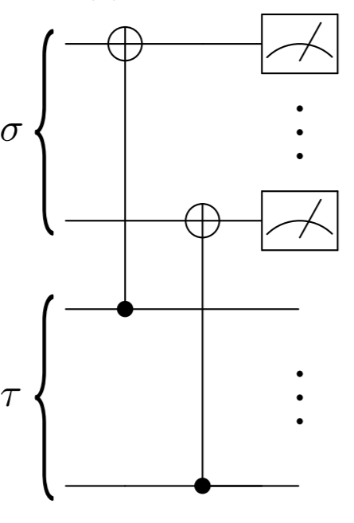
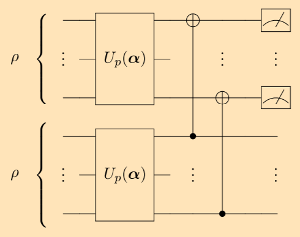
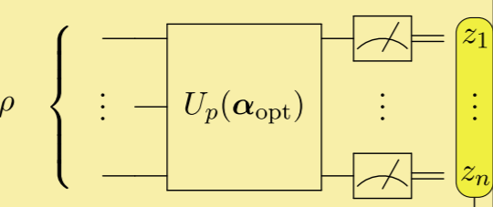

## Variational Quantum State Diagonalization (VQSD)

Variational Quantum State Diagonalization (VQSD) is a hybrid quantum-classical algorithm. Given a quantum state, can you find all its eigenvalues? Recall that every quantum state can be represented by a Hermitian matrix $\rho$, called density matrix, with non-negative eigenvalues which sum to 1. VQSD is such an algorithm that helps us find eigenvalues of $\rho$. The idea behind VQSD is quite simple; build a parameterized circuit $U(\overrightarrow\theta)$ and optimize the parameters $\overrightarrow\theta$ so that when you run this circuit on a density matrix $\rho$, you get a density matrix $\rho' = U(\overrightarrow\theta)\rho U^\dagger(\overrightarrow\theta)$ whose off-diagonal elements are nearly zero.
### Diagonalized Inner Product Test

Diagonalized Inner Product (DIP) test is an important procedure in VQSD. It is a circuit that calculates $\text{Tr}(Z(\sigma)Z(\tau))$, where the function $Z$ sets off-diagonal elements of a matrix to zero,
$$
Z(\begin{pmatrix}
\tau_{11} & \cdots & \tau_{1m}\\
\vdots & \ddots & \vdots\\
\tau_{m1} & \cdots & \tau_{mm}
\end{pmatrix}) = \begin{pmatrix}
\tau_{11} & \cdots & 0\\
\vdots & \ddots & \vdots\\
0 & \cdots & \tau_{mm}
\end{pmatrix}\,.
$$
The figure below shows the DIP circuit.



*Figure from[[1]](https://www.nature.com/articles/s41534-019-0167-6)*

As you can see, we prepare two states $\sigma$ and $\tau$, add serveral CNOT gates, measure the target qubits (the first half of qubits in this case), and record the result you get (a string of $0$ and $1$). Repeat the whole process many times, calculate the probability of getting $00\cdots0$, and that number will be an approximation of $\text{Tr}(Z(\sigma)Z(\tau))$. The more times you repeat the measurements, the more accurate the approximation will be.

### Parameterized Circuit

Now comes to the part where we have to figure out a way to find a good parameter set that makes $\rho' = U(\overrightarrow\theta)\rho U^\dagger(\overrightarrow\theta)$ a (almost) diagonal state.



*Figure from[[1]](https://www.nature.com/articles/s41534-019-0167-6)*

Figure above shows us how to do it. We prepare two copies of state $\rho$, run them through parameterized circuit, be aware that the two circuits have exactly the same parameters. Then we do a DIP test on two copies of state $\rho'$, calculate the frequency of getting $00\cdots0$, which, if you still remember, is an approximation of $Tr(Z(\rho')Z(\rho'))$. The higher the value of $Tr(Z(\rho')Z(\rho'))$, the more $\rho'$ will be a diagonalized state, If you want to know why, check it out in the original paper [[1]](https://www.nature.com/articles/s41534-019-0167-6). We have to find parameters $\overrightarrow\theta_\text{optimal}$ which minimize $-Tr(Z(\rho')Z(\rho'))$. See why $-Tr(Z(\rho')Z(\rho'))$ is a function of $\overrightarrow\theta$? We can now apply gradient descent method to finish the task.

### Eigenvalues Readout
After we find $\overrightarrow\theta_\text{optimal}$, run the parameterized circuit $U(\overrightarrow\theta_\text{optimal})$ on $\rho$ to get a diagonalized state $\rho'$, and then what? How can we get the diagonal elements (which are eigenvalues of $\rho$) of $\rho'$? Measurements, of course, a lot of measurements. 



*Figure from[[1]](https://www.nature.com/articles/s41534-019-0167-6)*

Because quantum states collapse after measurement, we need to prepare a lot of states $\rho'$. Measure them and record the result. Calculate the frequency of each qubit-string, and these frequency form an approximation of eigenvalues. Maybe you can't digest all of them in a short period, so let's code to help you go through the whole process.

### Simulation on Quantum Leaf

First we import relevant packages. Our example uses a 2-qubit pure state $\rho$ which is generated by a pre-defined circuit.
```
import Define from "../../../QCompute/Define/Define";
import {matchSdkVersion} from "../../../QCompute/Define/Utils";
import {QEnv} from "../../../QCompute/QPlatform/QEnv";
import {CX} from "../../../QCompute/QPlatform/Operation/FixedGate";
import {RX, RY, RZ} from "../../../QCompute/QPlatform/Operation/RotationGate";
import {BackendName} from "../../../QCompute/QPlatform/QPlatform";
import {MeasureZ} from "../../../QCompute/QPlatform/Operation/Measure";
import {QRegStorage} from "../../../QCompute/QPlatform/QRegPool";
```
Set up hyper-parameters and parameters:
```
const pi = 3.141592653589793;
const shots = 100000;
const n = 2;  // n-qubit
const delta = pi / 2;  // calculate derivative
const learning_rate = 0.5;  // learning rate
const N = 15;  // number of parameters
var para: number[] = new Array(N);
for (let i = 0; i < N; i++)  // initial parameters
{
    para[i] = Math.random();
    para[i] *= 2 * pi;
}
```


```
function state_prepare(q: QRegStorage[], i: number) {
    /*
    This function is used to prepare state
     */
    RX(0.1)(q[i]);
    RZ(0.4)(q[i + 1]);
    CX(q[i], q[i + 1]);
    RY(0.8)(q[i]);
    RZ(1.2)(q[i]);
}


function universal_cir(q: QRegStorage[], i: number, para: number[]) {
    /*
    This function builds a 15-parameterized circuit, which is
    enough to simulate any 2-qubit Unitaries
     */
    RZ(para[0])(q[i]);
    RY(para[1])(q[i]);
    RZ(para[2])(q[i]);

    RZ(para[3])(q[i + 1]);
    RY(para[4])(q[i + 1]);
    RZ(para[5])(q[i + 1]);

    CX(q[i + 1], q[i]);

    RZ(para[6])(q[i]);
    RY(para[7])(q[i + 1]);

    CX(q[i], q[i + 1]);

    RY(para[8])(q[i + 1]);

    CX(q[i + 1], q[i]);

    RZ(para[9])(q[i]);
    RY(para[10])(q[i]);
    RZ(para[11])(q[i]);

    RZ(para[12])(q[i + 1]);
    RY(para[13])(q[i + 1]);
    RZ(para[14])(q[i + 1]);
}


async function my_cir(para: number[]) {
    /*
    This function returns the measurement result
     */
    const env = new QEnv();
    env.backend(BackendName.CloudBaiduSim2Water);
    const q = env.Q.createList(2 * n);

    // Prepare a state
    for (let i = 0; i < 2; i++)
        state_prepare(q, 2 * i);

    // Add parameterized circuit
    for (let i = 0; i < 2; i++)
        universal_cir(q, 2 * i, para);

    // DIP test
    for (let i = 0; i < 2; i++)
        CX(q[i], q[i + n]);

    MeasureZ(...env.Q.toListPair());
    return await env.commit(shots, true);
}
```

```
function data_processing(data_dic): number {
    /*
    This function returns the frequency of getting 00xx
     */
    let sum_0 = 0;
    for (let k in data_dic) {
        if (k[0] == '0' && k[1] == '0')
            sum_0 += data_dic[k];
    }
    return sum_0 / shots;
}


async function loss_fun(para: number[]) {
    /*
    This is the loss function
     */
    let tr = await my_cir(para);

    return -1 * data_processing(tr)
}


async function diff_fun(f, para) {
    /*
    It returns a updated parameter set
     */
    let para_length = para.length;
    let gradient: number[] = new Array(para_length);

    for (let i = 0; i < para_length; i++) {
        let para_copy_plus: number[] = para.concat();
        let para_copy_minus: number[] = para.concat();
        para_copy_plus[i] += delta;
        para_copy_minus[i] -= delta;

        gradient[i] = (await f(para_copy_plus) - await f(para_copy_minus)) / 2;
    }

    let new_para: number[] = para.concat();
    let res: number[] = [];
    for (let i = 0; i < para_length; i++) {
        res = res.concat(new_para[i] - learning_rate * gradient[i]);
    }
    return res;
}
```

```
async function main() {
    /*
    Now we perform eigenvalues readout
     */
    let para_list = [para];
    let loss_list: number[] = [];

    for (let i = 0; i < 5; i++) {
        // @ts-ignore
        para_list[i + 1] = await diff_fun(loss_fun, para_list[i]);
        // @ts-ignore
        loss_list = loss_list.concat(await loss_fun(para_list[i]));
    }

    const env = new QEnv();
    env.backend(BackendName.CloudBaiduSim2Earth);

    const q = env.Q.createList(n);

    state_prepare(q, 0);
    console.log(para_list.length);
    universal_cir(q, 0, para_list[para_list.length - 1]);

    MeasureZ(...env.Q.toListPair());
    const taskResult = await env.commit(shots, true);
    console.log(taskResult['counts']);
}


main();
```

One of the experiments gave me:

```
{'00': 99563, '01': 405, '10': 27, '11': 5}
```

which translates to frequency $0.995, 0.004, 0.0027, 0.0005$, not far from true eigenvalues $1,0,0,0$.
